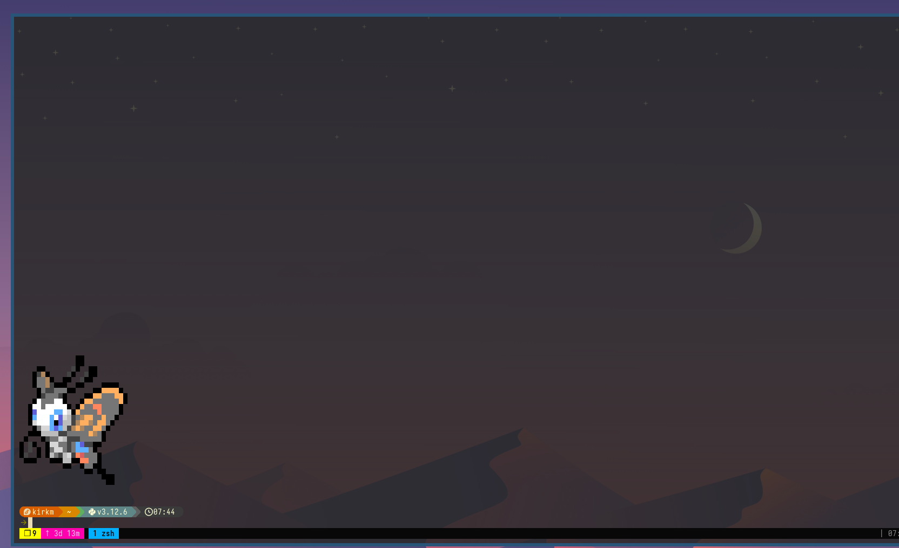
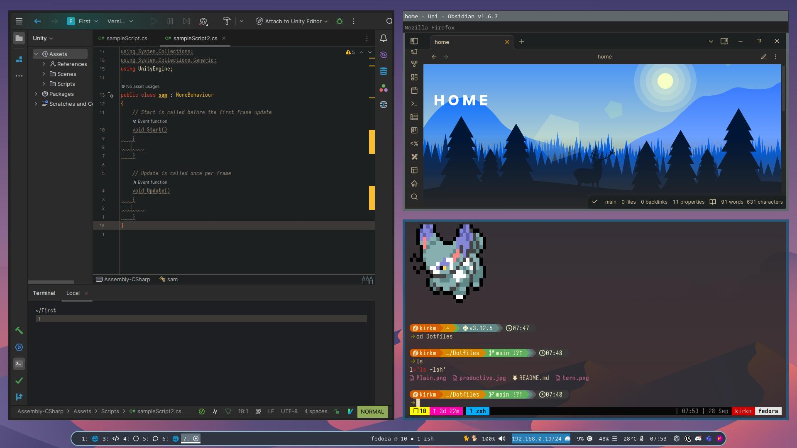

# Swaybox

Welcome to my dotfiles! A mix of blue and pink for background colors and gruvbox for everything productive. Currently a work in progress but wanted to share what I had :) \\

## Dependancies

### Essential

Required for the dotfiles to work, these are avaliable in most package managers

#### Debian based distros (Ubuntu etc.)

`sudo apt install tmux alacritty mako neovim rofi sway waybar`

#### Red had distros (Fedora, RHEL etc.)

`sudo dnf install tmux alacrutty mako neovim rofi sway waybar`

### Optional

A bit more hassle to install but adds some nice features

- [starship](https://starship.rs/installing/)
- [openpomodoro-cli](https://github.com/open-pomodoro/openpomodoro-cli)
- [pokemon-colorscripts](https://github.com/Findarato/pokemon-colorscripts)
- `flameshot`

## Install

This install will back up all previous dotfiles so not to worry

```
git clone git@github.com:Th0ught09/Dotfiles.git
mv ~/.zshrc ~/.zshrc.backup
cp .zshrc ~/
mv ~/.tmux ~/.tmux.backup
cp .tmux ~/
cd .config
for file in ./*
do
entry=${file:2}
mv ~/.config/$entry ~/.config/$entry.backup
cp -r ./$entry ~/.config/
done
```

## Features

- `Ctrl + Shift + P` to start a pomodoro timer in waybar and `Ctrl + Shift + O` to cancel
- Attaches different windows to monitors (monitors need to be configured using `swaymsg -t get_outputs` and added in `~/.config/sway/config` under the `$mon1` and `mon2` variables)
- Most Keybinds are made in accordance to the Kinesis Advantage 2 if they seem a bit weird!
- `Ctrl + Shift + S` for a flameshot screenshot

## Screenshots




