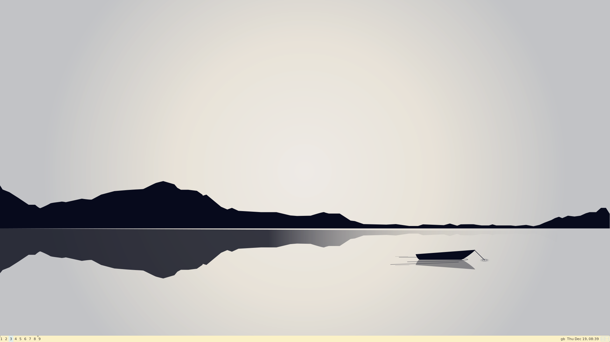

# Swaybox

Welcome to my dotfiles! A mix of blue and pink for background colors and gruvbox light for everything productive. Currently a work in progress but wanted to share what I had :) \\

## Dependancies

### Essential

Required for the dotfiles to work, these are available in most package managers

#### Debian based distros (Ubuntu etc.)

`sudo apt install tmux alacritty mako neovim rofi sway waybar`

#### Red had distros (Fedora, RHEL etc.)

`sudo dnf install tmux alacritty neovim rofi`

### Optional

A bit more hassle to install but adds some nice features

- [starship](https://starship.rs/installing/)
- `flameshot`

## Install

This install will back up all previous dotfiles so not to worry

```
git clone git@github.com:Th0ught09/Dotfiles.git
cd ~/.config
for file in ./*
do
entry=${file:2}
mv ~/.config/$entry{,.bak}
cp -r ./$entry ~/.config/
done
```

## Features

- Most Keybinds are made in accordance to the Kinesis Advantage 2 if they seem a bit weird!
- `Ctrl + S` for a flameshot screenshot

## Screenshots



